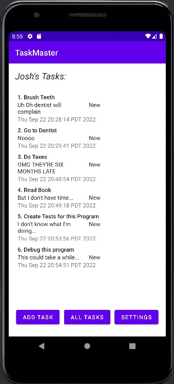

# Task Master

An app for tracking tasks and their completion.

## 22 September 2022
### Database Persistence
- Added Room DB dependencies
- Updated Task class to Entity
- Moved TaskState enum to subclass of Task
  - implemented string conversion methods for Enum
- Built Data Access Object (DAO) class for Task
- Built Database (Room) class with Task entity & TaskDAO
- Added Date created field to Task
- Added Date created display to Adapter & Layout for RecyclerView
- Add DB to MainActivity and Load it to the RecyclerView
  - Method to setup database called in onCreate
  - Methods to reset list used in RecyclerView called in onResume
- DB setup for AddTask Activity
  - Tasks Added Count added; 0 on create; increments with adds
    - Updates tasks added count display on add 
  - Setup method to add tasks to DB
  - Added Toast for successful submission
  - Ensured empty title task can't be added
- Updated TaskAdapter and TaskDetails to carry over title, description, date, and state.
- Added Espresso Tests (with Recorder)

## 21 September 2022
### RecyclerView
- Created Task Class
- Placed RecyclerView Component in Main Activity
- Created methods in Main Activity Java to set RecyclerView layout & adapter, and load with sample Task data
- Created fragment class and layout for displaying tasks in RecyclerView
- Created Adapter & ViewHolder class to setup items for display in recycler
- Stretch: fill in details on TaskDetails Activity from recycler object call

---

## 20 September 2022
- Created Settings Page
  - TextView with hint for entering username.
  - Save button.
  - Toast popup.
  - Saved to DefaultSharedPreferences under userName Key.
  - Updated parent in Manifest for upward navigation
  - User Name ExitText filled in with username if already exists
- Create Task Details Page
  - Created Title TextView
    - Title Fills in from Main page's Intent (the task title)
  - Created Description Text View
  - Updated parent in Manifest for upward navigation
- Adjusted Home/Main Page
  - Add Three Buttons With Task Titles
    - Wrote method to open Task Detail's Page with relevant Title in Intent
  - Username loaded and displayed from DefaultSharedPreferences, on create & resume
  - Added Button to load Settings page

---

## 19 September 2022
- Added Activities for Home, Add Task, and All Tasks
- Added text views to all Activities
- Added image views to Home & All to display title and fill in for future task list display.
- Added buttons to home that navigate to Add & All Activities.
- Added upward navigation to All & Add Activities
- Added submit Add button to AddTask Activity that causes a text element to display "Submitted!"
- All text & button fields obtained from strings.hml in res/values

---